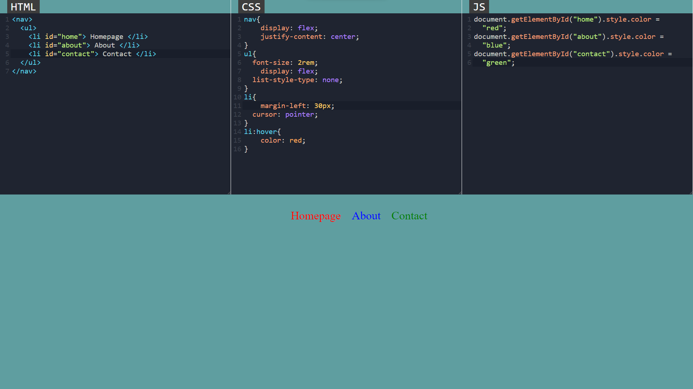

# CodeXC---Live-Code-Editor

## Table of contents

- [Overview](#overview)
  - [Goal](#the-challenge)
  - [Screenshot](#screenshot)
  - [Links](#links)
  - [Built with](#built-with)
- [Author](#author)

## Overview

### Goal

Users should be able to:

- Write HTML, CSS and JS codes to the editor
- Editor will give you the live results. 
- Resize HTML-CSS-JS editors horizontally

### Screenshot

### Built with

- Semantic HTML5 markup
- CSS3
- Flexbox
- Vanilla Javascript
- Codemirror

## Author

- Muhammet Fatih Gül
